# Manual — NPS em Meus Clientes

Guia operacional para **gestores de área** e **colaboradores responsáveis** pelo envio da pesquisa NPS.

> **Auto-instructor no sistema:** abra **Meus Clientes** e clique em **Ver guia** no cabeçalho. O tour interativo adapta os passos conforme seu perfil (gestor ou responsável).

---

## Visão geral

O fluxo NPS tem **dois papéis**:

| Papel | Quem é | O que faz |
|-------|--------|-----------|
| **Gestor da área** | Sócio/gerente cadastrado em *Gestores por área* | Designa **quem contata** cada grupo de clientes |
| **Responsável (quem contata)** | Colaborador escolhido pelo gestor | Completa cadastros, marca elegíveis ao NPS, envia o link e cobra a resposta |

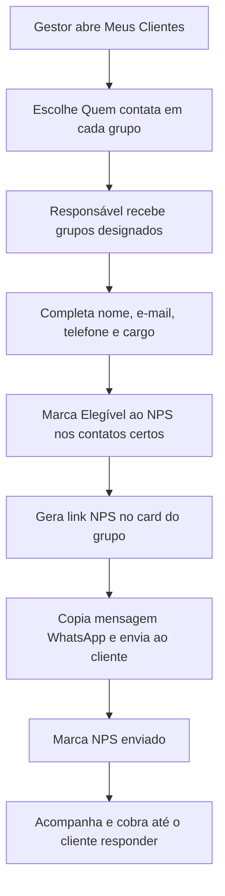

---

## Parte 1 — Gestor da área

### Pré-requisitos

- Acesso ao módulo **Meus Clientes** (`/meus-clientes`)
- Cadastro como **gestor oficial** da área (ex.: Cível, Trabalhista, Recuperação de Crédito)
- Grupos de clientes com **área responsável** definida (feito pela administração quando necessário)

### Passo 1 — Acessar Meus Clientes

1. Faça login no ORQESTRAI.
2. No menu lateral, abra **Meus Clientes**.
3. Você verá os clientes da sua área, barra de progresso, cards de completos/pendentes e filtros.

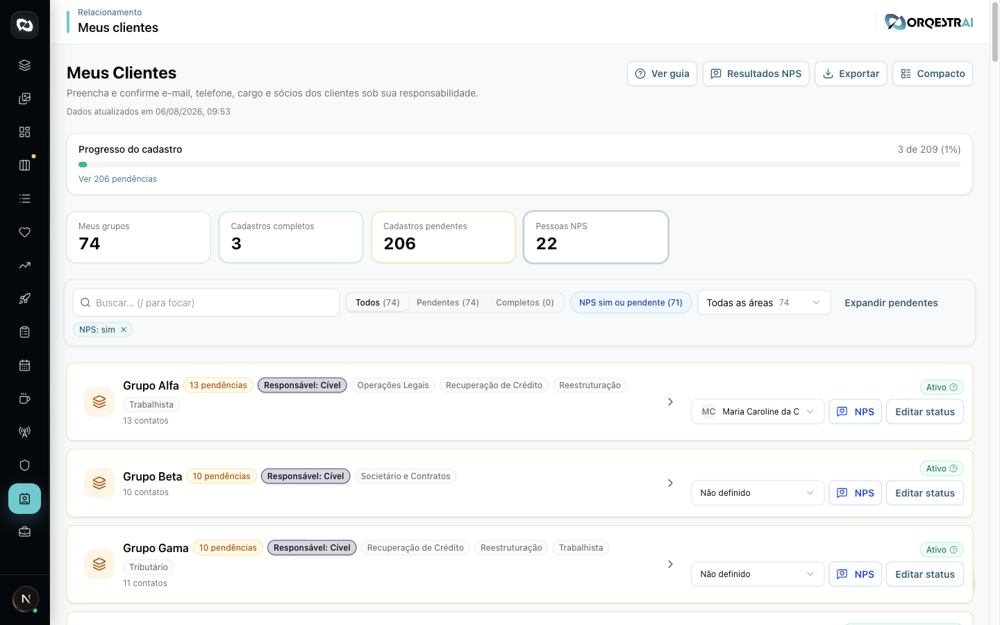

*Figura 1 — Cabeçalho, barra de progresso, estatísticas e botão **Ver guia**.*

---

### Passo 2 — Identificar pendências

1. Observe a barra **Progresso do cadastro**.
2. Clique em **Ver pendências** (se houver) ou no card **Cadastros pendentes**.
3. Priorize grupos com badge de pendência (ex.: *“3 pendências”*).

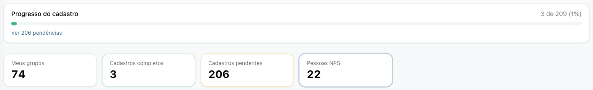

*Figura 2 — Use os cards para filtrar o que falta antes do envio do NPS.*

---

### Passo 3 — Expandir um grupo de clientes

1. Clique no card do cliente para expandir.
2. Confira a **área responsável** (badge) e o **status comercial** (ativo/inativo).
3. Se o status ainda não foi confirmado, peça ao responsável que confirme antes do NPS.

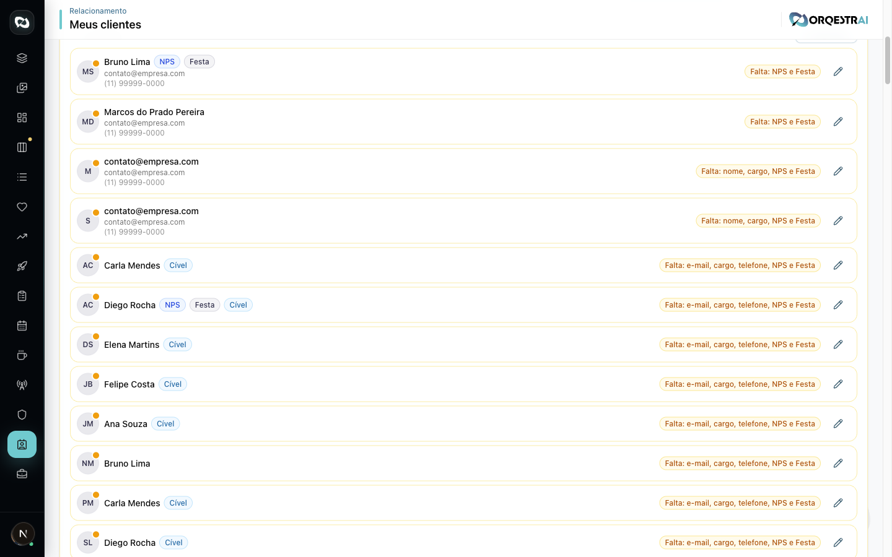

*Figura 3 — Lista de contatos, área e ações do grupo.*

---

### Passo 4 — Designar quem contata (ação principal do gestor)

1. No cabeçalho do card expandido, localize o select **Quem contata**.
2. Escolha o colaborador da **mesma área** do grupo (ex.: só advogados de Cível em grupos Cível).
3. A seleção salva automaticamente.
4. Repita para **todos os grupos** da sua área.

> **Importante:** só o **gestor oficial** da área vê e edita este campo. Demais usuários veem apenas o badge *“Contato: Nome”*.

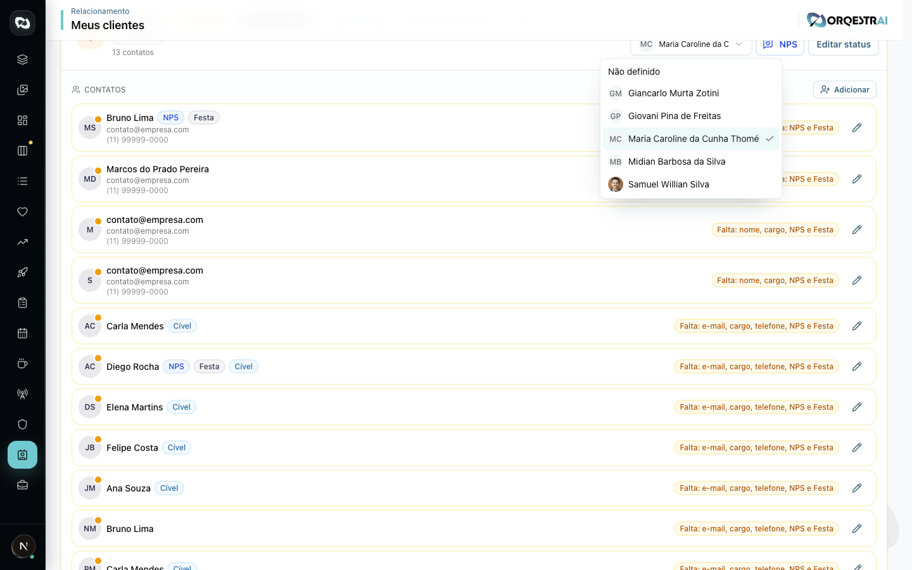

*Figura 4 — Gestor designando o responsável pelo NPS daquele grupo.*

---

### Passo 5 — Acompanhar o trabalho do responsável

Como gestor, você **não precisa** enviar o link pessoalmente (salvo se for você o responsável designado). Seu papel é:

1. Garantir que **todos os grupos** tenham alguém em **Quem contata**.
2. Cobrar o responsável até:
   - cadastros completos;
   - contatos marcados como **Elegível ao NPS**;
   - badge **Enviado** aparecer no card (NPS enviado ao cliente).
3. Usar **Exportar** se precisar de planilha para controle interno.

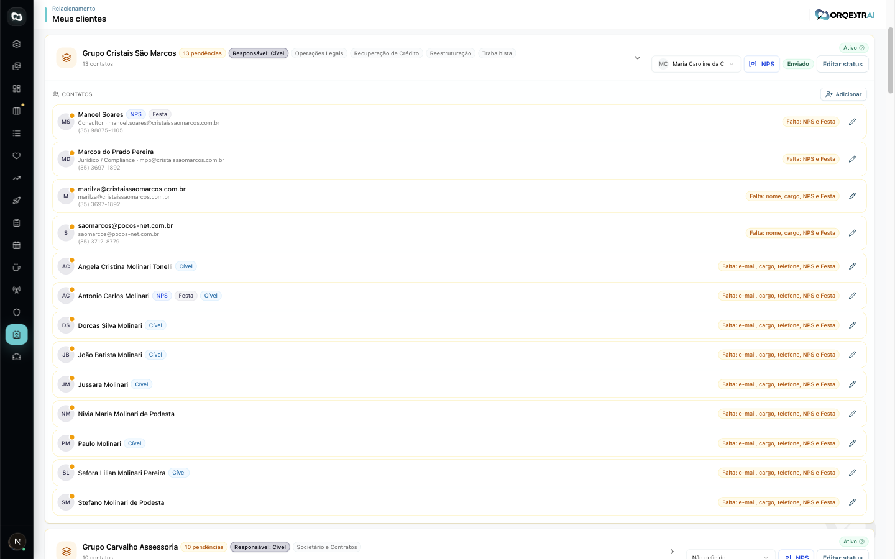

*Figura 9 — Grupo com NPS já enviado (badge verde **Enviado**).*

---

## Parte 2 — Responsável (quem contata)

### Pré-requisitos

- Acesso ao módulo **Meus Clientes**
- Ter sido designado pelo gestor em **Quem contata** (ou ser advogado responsável pelo grupo)
- Campanha NPS **ativa** (configurada pelo marketing/administração)

### Passo 1 — Localizar seus grupos

1. Abra **Meus Clientes**.
2. Use a busca ou filtros para encontrar seus clientes.
3. Grupos onde você é o contato exibem **Contato: seu nome** (ou você reconhece o cliente pela sua carteira).

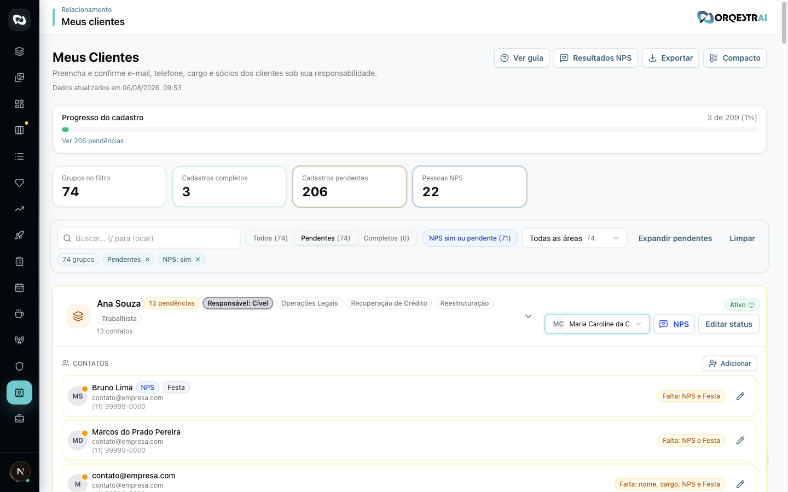

*Figura 5 — Filtro de cadastros pendentes.*

---

### Passo 2 — Confirmar status comercial

1. Expanda o card do grupo.
2. Clique em **Confirmar status** ou **Editar status**.
3. Informe se o cliente está **ativo** ou **inativo**.
4. Para inativos, preencha motivo e data (término de vigência ou rescisão).

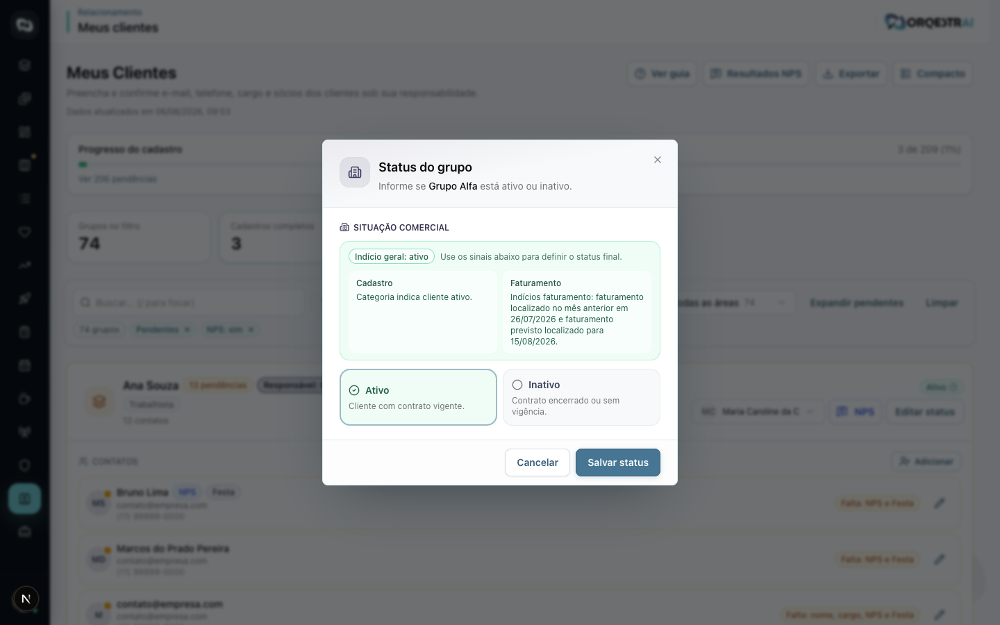

*Figura 6 — Confirmação de status antes do envio.*

---

### Passo 3 — Completar cadastro de cada contato

1. No card expandido, clique no **lápis** ao lado do contato.
2. Preencha ou confira:
   - **Nome**
   - **E-mail**
   - **Telefone**
   - **Cargo**
3. O formulário mostra um checklist — todos os itens devem ficar verdes para cadastro completo.

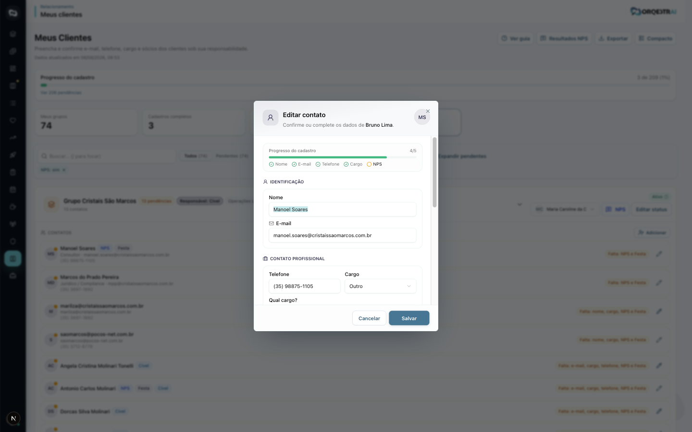

*Figura 7 — Checklist de progresso do cadastro.*

---

### Passo 4 — Marcar elegíveis ao NPS

No mesmo formulário, seção **Classificação**:

1. Marque **Elegível ao NPS** para cada pessoa do grupo que **pode responder** a pesquisa (geralmente decisores/contatos principais).
2. Se alguém **não participa** da pesquisa, use **Sem NPS**.
3. Clique em **Salvar**.

> **Gestores:** a opção *Festa de 10 anos* fica inativa — apenas a administração altera convites de festa.

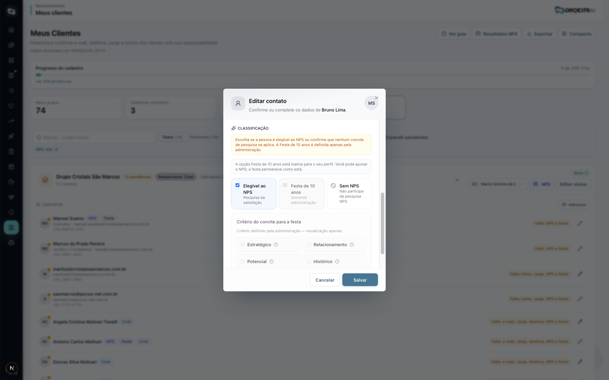

*Figura 8 — Checkbox **Elegível ao NPS** / **Sem NPS**.*

---

### Passo 5 — Gerar e enviar o link NPS

1. Volte ao card do grupo (fechado ou expandido).
2. Clique no botão **NPS** (habilitado quando há pelo menos 1 elegível).
3. No dialog:
   - copie o **link da pesquisa** ou a **mensagem WhatsApp**;
   - envie ao cliente pelo canal combinado (geralmente WhatsApp).
4. **Depois de enviar**, clique em **NPS enviado** — isso registra quem mandou e quando (não pode desfazer).
5. O card passa a exibir o badge **Enviado**.

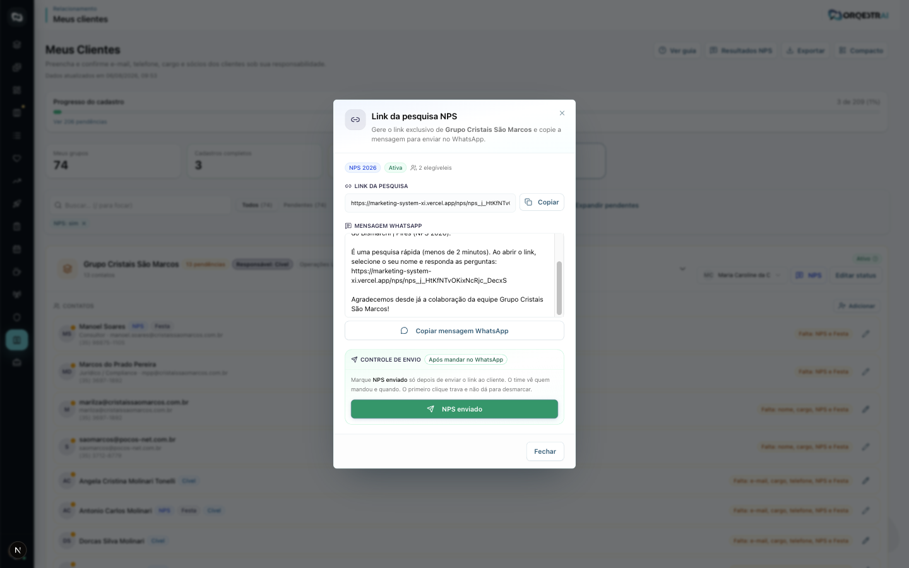

*Figura 10 — Copiar mensagem, enviar ao cliente e marcar **NPS enviado**.*

---

### Passo 6 — Cobrar e acompanhar resposta

1. Se o cliente não responder em alguns dias, **cobre** gentilmente (WhatsApp, e-mail ou ligação).
2. No dialog NPS, veja a seção **Já responderam** quando houver respostas.
3. Para visão consolidada da área, use **Resultados NPS** no cabeçalho.

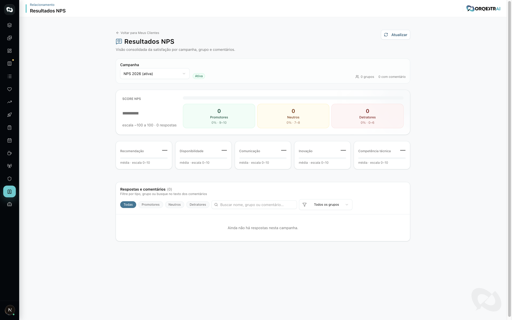

*Figura 11 — Página de resultados da campanha.*

---

## Checklist rápido

### Gestor

- [ ] Todos os grupos da área têm **Quem contata** definido
- [ ] Responsáveis cientes da tarefa
- [ ] Acompanhar grupos sem badge **Enviado**
- [ ] Cobrar responsáveis com cadastros pendentes

### Responsável

- [ ] Status comercial confirmado
- [ ] Nome, e-mail, telefone e cargo de cada contato
- [ ] **Elegível ao NPS** marcado corretamente
- [ ] Link enviado ao cliente
- [ ] **NPS enviado** marcado no sistema
- [ ] Cliente cobrado até responder

---

## Perguntas frequentes

**Por que o botão NPS está desabilitado?**  
Nenhum contato do grupo está marcado como **Elegível ao NPS**, ou o cadastro ainda está incompleto.

**Posso enviar NPS para contato sem e-mail?**  
Não. E-mail (e demais campos obrigatórios) precisa estar preenchido.

**Quem pode alterar “Quem contata”?**  
Somente o **gestor oficial** da área responsável do grupo.

**Cível e Recuperação de Crédito são a mesma área?**  
Não. Cada área tem gestor e colaboradores próprios; o select **Quem contata** lista só pessoas da área exata do grupo.

**Como rever o passo a passo interativo?**  
Clique em **Ver guia** no cabeçalho de Meus Clientes.

---

## Capturas de tela (manutenção)

As imagens deste manual ficam em `docs/images/meus-clientes/`. Para gerar ou atualizar:

1. Acesse `/meus-clientes` em ambiente de staging ou produção.
2. Capture as telas listadas em [images/meus-clientes/README.md](images/meus-clientes/README.md).
3. Mantenha os nomes dos arquivos para o manual continuar linkado.

---

*Última atualização: agosto/2026 — ORQESTRAI Marketing System*
